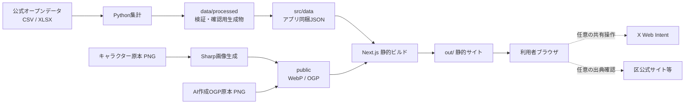
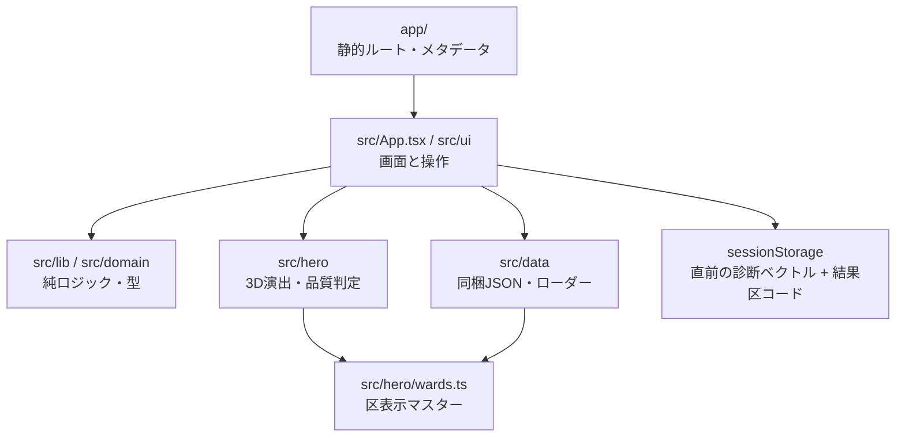

# システム全体設計

## 1. 目的とシステム境界

「うちの区ちゃん診断図鑑」は、東京23区のオープンデータを5軸の性格ベクトルへ変換し、10問の回答から距離上位5区以内の区を提示する日本語のWebアプリケーションである。診断結果は全23区の回答パターン比率が1%以上10%以下になるようビルド時に校正する。診断、23区図鑑、区詳細、共有用の診断結果ページを提供する。

本番成果物は静的サイトであり、実行時のサーバー、データベース、認証、外部データAPIを持たない。画面表示に必要なデータと画像はサイト内から配信する。外部サイトへの遷移は、利用者がX共有または区の政策出典リンクを明示的に開いた場合だけ発生する。

## 2. 技術構成

| 領域 | 採用技術 | 用途 |
|---|---|---|
| アプリケーション | Next.js App Router / React / TypeScript | 静的ルート生成とクライアントUI |
| 3D描画 | Three.js / React Three Fiber | スクロール連動3Dヒーロー |
| テスト | Vitest / Testing Library / jsdom | 純ロジックとReactコンポーネントの単体テスト |
| データ集計 | Python 3 / openpyxl | CSV・XLSXから区別スナップショットを生成 |
| 画像生成 | Node.js / Sharp | キャラクター・タイトルのWebPを生成。OGPはAI作成の原本を加工して配置する |
| 配信 | Next.js `output: 'export'` / Cloudflare Pages | `out/` の静的配信 |

依存バージョンの宣言は `package.json` と `package-lock.json`、TypeScript設定は `tsconfig.json`、テスト設定は `vitest.config.ts` を正とする。

## 3. 実行時アーキテクチャ

Next.jsのページモジュールが静的パラメータとメタデータを生成し、画面本体はクライアントコンポーネントとして動く。診断ロジックと区データはJavaScriptバンドルへ含まれ、ブラウザ内で完結する。

## 4. ディレクトリ責務

| パス | 責務 |
|---|---|
| `app/` | App Routerのルート、全体メタデータ、CSS |
| `src/domain/` | 5軸ベクトルと区データの型 |
| `src/lib/` | 正規化、採点、距離、順位、k-means、セッション保存 |
| `src/data/` | 配信用JSONスナップショットとデータローダー |
| `src/ui/` | 診断、図鑑、詳細、結果、レーダーUI |
| `src/hero/` | スクロール連動3Dヒーローと2Dフォールバック |
| `data/raw/` | 取得した公式データ原本 |
| `data/processed/` | Pythonで再生成する確認用JSON/CSV |
| `assets/` | キャラクター、タイトル、OGP（AI作成）の原本 |
| `public/` | ブラウザへ配信する画像 |
| `scripts/` | 診断割り当て、画像変換 |
| `out/` | 静的エクスポート成果物。手編集しない |

## 5. 設計上の制約

- 23区分の全ページとOGP参照先をビルド時に確定する。
- 区の5軸と系統は、同梱した実データから決定的に算出する。
- 利用者の個別回答は保存せず、採点後の5軸ベクトルと結果区コードだけを外部送信せずに同一タブの `sessionStorage` へ保存する。
- WebGLや動きの利用が難しい環境では、主要導線を2D表示へ切り替える。
- キャラクター画像は原本を直接配信せず、用途別に生成したWebPを配信する。
- UIコピーは日本語とし、区の特性を優劣ではなく個性として表現する。

## 6. 非対象

管理画面、ユーザーアカウント、診断履歴の永続化、サーバーサイドAPI、リアルタイムデータ更新、投稿の自動送信は現行システムに含まれない。
