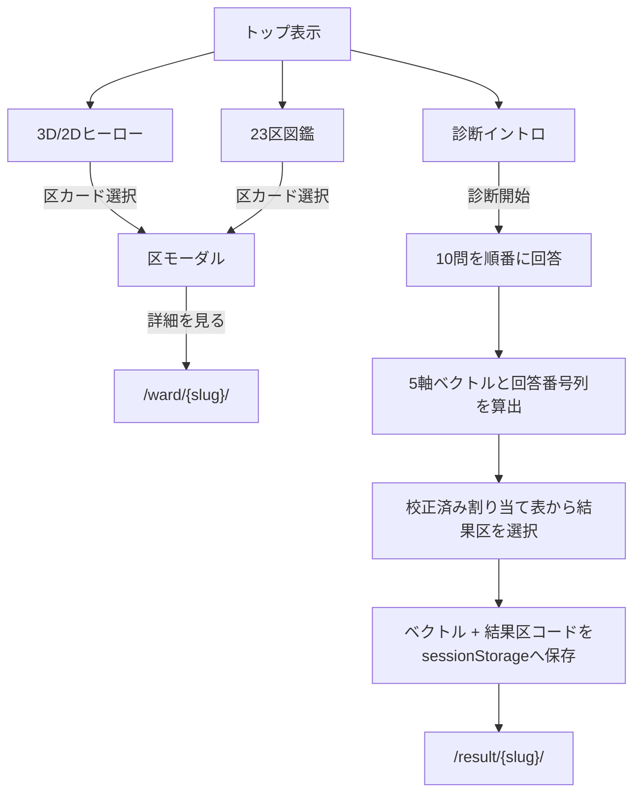

# アプリケーション設計

## 1. URLと静的生成

`next.config.ts` は `output: 'export'`、`trailingSlash: true`、画像最適化無効を指定する。動的セグメントは `generateStaticParams()` で23区分を列挙するため、実体はすべてビルド時に静的生成される。

| URL | ページ | 生成方式 | 主な責務 |
|---|---|---|---|
| `/` | `app/page.tsx` | 静的 | ヒーロー、診断、図鑑、区モーダル |
| `/result/{slug}/` | `app/result/[slug]/page.tsx` | 23区分のSSG | 診断結果または共有着地、OGPメタデータ |
| `/ward/{slug}/` | `app/ward/[slug]/page.tsx` | 23区分のSSG | 区の詳細指標、順位、同系統リンク、OGPメタデータ |
| `/sitemap.xml` | `app/sitemap.ts` | 静的 | 全47URL（トップ+区詳細23+結果23）のsitemap |
| `/robots.txt` | `app/robots.ts` | 静的 | 全許可 + Sitemap参照 |

区コードとslugの対応は `src/data/slugs.ts` が `src/hero/wards.ts` から組み立てる。各動的ページも同じ対応表を静的パラメータに使う。

SEOメタデータの方針:

- 全ページに `alternates.canonical` を設定する（トップ `/`、区詳細 `/ward/{slug}/`、結果 `/result/{slug}/`）。絶対URL化は `app/layout.tsx` の `metadataBase`（`NEXT_PUBLIC_SITE_URL`）に依存する。
- sitemapのURL列挙は純ロジック `src/lib/seo.ts` の `buildSitemapEntries()` が担い、URL末尾は `trailingSlash: true` と一致させる。
- `app/sitemap.ts` と `app/robots.ts` は `NEXT_PUBLIC_SITE_URL` 未設定時に本番URL `https://uchinokuchan.pages.dev` へフォールバックする（OGP・canonicalと異なり相対URLが許されないため）。

## 2. クライアント境界

- `app/layout.tsx` と各動的ページモジュールは、静的HTMLとメタデータを生成する層である。
- 全ルート共通のファビコン、Apple Touch Icon、Web App Manifestは `public/favicon/` に配置し、`app/layout.tsx` のメタデータから参照する。
- `src/App.tsx`、`ResultPage`、`WardPage` は操作を扱うクライアントコンポーネントである。
- `HeroCanvas` と `WardMap3D` は `next/dynamic` の `ssr: false` で遅延ロードし、サーバー描画の対象外とする。
- 区データはJSON importでバンドルされ、`fetch` は行わない。

## 3. トップページ

`src/App.tsx` がトップページのUI状態を所有する。

| 状態 | 型・値 | 用途 |
|---|---|---|
| `selectedCode` | `string \| null` | ヒーローまたは図鑑で選んだ区のモーダル表示 |
| `phase` | `intro \| quiz` | 診断の開始前と回答中を切り替える |

トップページの処理は次のとおり。

診断は戻る・回答変更・中断復元を持たない。全10問を回答すると即時に結果ページへ遷移する。

区モーダルは図鑑から区詳細へ進むための概要表示とする。ステータスバーはレーダー5軸の根拠となる基本7指標（昼夜間人口比率、高齢化率、年少人口率、一人当たり公立公園面積、単身世帯率、子育て世帯率、財政力指数）に限定する。地価、外国人人口比率、平均所得、人口千人当たり刑法犯認知件数、待機児童数はモーダルに出さず、区詳細ページでのみ表示する。

## 4. 診断結果ページ

`ResultPage` はURLのslugから表示対象の区を決め、マウント後に `sessionStorage` の診断ベクトルと結果区コードを読む。保存された結果区コードとURLの区が一致する場合だけ診断者表示とし、それ以外は共有された結果の受け手表示にする。

診断者表示は次の順で構成する。

1. 結果カード: 区別OGP画像へ区名と `similarityPercent()` による「にてる度」を重ね、キャッチコピー、一致軸2本から作るハッシュタグ、X共有、区詳細への導線を同じカード内に置く
2. タイプの特徴: `src/data/ward-traits.json` の区別3行と、利用者ベクトルから `personaType()` が導くタイプ名・説明文を表示する
3. 相性の理由: ページ内で唯一のレーダーに利用者ベクトルを破線で重ね、`selectMatchedAxes()` が選ぶ一致軸2本だけを比較バーで示す。軸差0.5以下の軸へ「ここが一致！」を付け、一致軸1位のAI執筆相性文を表示する
4. もっと詳しく: `
` を使い、キャラクター設定理由、一致軸に対応する基本指標2件と政策1件、基本7指標のステータスを3つのアコーディオンへ分ける。レーダーは重複表示せず、ステータス内から区詳細へリンクする
5. 相性ランキング: 校正結果区を除き、利用者ベクトルとの未校正距離が近い他区3件をOGP画像付きで表示する。表示%は `compatibilityPercents()` で結果区を超えないよう補正する
6. 共有導線: ページ末尾のX共有CTAに加え、640px以下では画面下部にも追従共有バーを表示する

共有された結果の受け手表示は、URLが示す区のOGP画像、キャッチコピー、診断開始導線と、「もっと詳しく」内のキャラクター設定理由・基本7指標を表示する。利用者ベクトルがないため、タイプの特徴、相性の理由、一致軸データと政策、相性ランキング、X共有導線は表示しない。

URLには区slugだけが含まれ、回答や5軸ベクトルは含まれない。このため共有先では相性ランキングや利用者ベクトルを再現しない。OGPの公開パスは `/og/{slug}.jpg` である。

回答番号列そのものは保存しない。校正済みの結果区コードを保存することで、回答パターンを保持せずに結果ページの整合性を維持する。

## 5. 区詳細ページ

`WardPage` は区を知るための図鑑本編であり、キャラクター、設定理由、位置、プロフィール、政策、5軸と根拠統計、同系統区を1ページにまとめる。

レイアウトは固定ポートレート型の2カラムである。左カラムにキャラクター立ち絵、系統バッジ、名前、キャッチコピーを置き、PC幅（900px超）では `position: sticky` でスクロール中も表示し続ける。右カラムは優先度順のカードセクション（`Section`。線画SVGアイコン付き見出し `SectionIcon`）として次の順に並べる。900px以下では1カラムの縦積みになり、stickyは解除する。

1. キャラクター設定理由: `src/data/rationale.ts` に同梱した23区分のAI執筆解説文。実データ指標（昼夜間人口比率、財政力指数など）からデザイン判断への流れを説明し、「AIによるキャラクター設定」バッジを見出しに付す
2. 位置: 23区境界データを使う3D地図。WebGLを使えない場合は同じ区を強調する2D SVG地図
3. プロフィール: 区章、人口、面積、収録済みの花・木・鳥
4. こころざし（政策）: 手動キュレーションした区の政策概要と外部出典リンク
5. ステータス: 正規化済み5軸のレーダーと、基本7指標＋地価、外国人人口比率、平均所得、人口千人当たり刑法犯認知件数、待機児童数のうちデータが存在する項目の統計バー
6. 区内の主要駅、同系統のなかま（k-meansで同じ数値ラベルになった区へのリンク）、出典（基本指標、詳細指標、行政区域データのスナップショット出典）

順位は同値を同順位とし、次順位を詰めない競技順位方式である。待機児童数だけ値を負数へ変換し、少ない区を上位として表示する。統計バーは23区平均を50%位置として、平均比2.0以上を100%に丸める。

## 6. コンポーネント責務

| コンポーネント | 責務 |
|---|---|
| `App` | トップページの状態と画面遷移 |
| `Hero` | 品質判定、3D/2D切り替え、ヒーロー統合 |
| `Diagnosis` | 質問進行と回答の収集 |
| `Zukan` | 23区カード一覧 |
| `WardModal` | トップ内の区概要、レーダー、レーダー根拠の基本7指標、詳細導線 |
| `ResultPage` | 診断セッションの有無に応じた結果カード、タイプ特徴、相性理由、アコーディオン、相性ランキング、共有導線の出し分け |
| `WardPage` | 区の全指標と関連区の表示（固定ポートレート型2カラム、優先度順カードセクション） |
| `SectionIcon` | 区詳細ページのセクション見出し用線画SVGアイコン |
| `WardMapSection` | 品質判定と3D/2D区地図の切り替え |
| `WardMap3D` / `WardMap2D` | 行政区域データによる区位置の描画 |
| `Radar` | 5軸ベクトルのSVGレーダー可視化（モーダル・結果・区詳細で共用） |
| `StatBar` | 指標1行の平均比バー表示（項目選定はモーダルと区詳細ページで分離） |
| `xShareText` / `xShareUrl` / `xWeightedLength`（`share.ts`） | X投稿文面生成・Web Intent URL生成・加重文字数計算 |

`src/ui/WardDetail.tsx` と `ShareCard.tsx` の `ShareCard` コンポーネントは現行ルートから参照されていない。`ResultPage` が直接利用するのは `src/ui/share.ts` の `xShareUrl()` だけである（`xShareText()` は `xShareUrl()` から内部的に呼ばれる）。未使用コードとしての扱いは [07-risks-and-concerns.md](07-risks-and-concerns.md) に記載する。

## 7. エラー時の挙動

- `sessionStorage` の書き込み・読み取り例外は画面を停止させない。保存値が存在しない、または不正な場合、結果ページは共有受け手表示になる。
- WebGL非対応、`prefers-reduced-motion`、Canvas初期化例外では、ヒーローと区地図をそれぞれ2D表示へフォールバックする。
- 静的パラメータ外のslugはエクスポートされず、ホスティング側の404になる。
- コード上は生成対象slugと区詳細データの存在を非null assertionで前提としている。整合性はデータテストで担保する。
