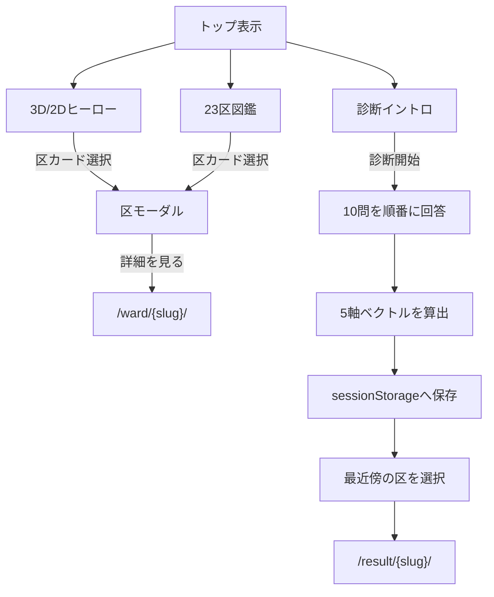

# アプリケーション設計

## 1. URLと静的生成

`next.config.ts` は `output: 'export'`、`trailingSlash: true`、画像最適化無効を指定する。動的セグメントは `generateStaticParams()` で23区分を列挙するため、実体はすべてビルド時に静的生成される。

| URL | ページ | 生成方式 | 主な責務 |
|---|---|---|---|
| `/` | `app/page.tsx` | 静的 | ヒーロー、診断、図鑑、区モーダル |
| `/result/{slug}/` | `app/result/[slug]/page.tsx` | 23区分のSSG | 診断結果または共有着地、OGPメタデータ |
| `/ward/{slug}/` | `app/ward/[slug]/page.tsx` | 23区分のSSG | 区の詳細指標、順位、同系統リンク、OGPメタデータ |

区コードとslugの対応は `src/data/slugs.ts` が `src/hero/wards.ts` から組み立てる。各動的ページも同じ対応表を静的パラメータに使う。

## 2. クライアント境界

- `app/layout.tsx` と各動的ページモジュールは、静的HTMLとメタデータを生成する層である。
- `src/App.tsx`、`ResultPage`、`WardPage` は操作を扱うクライアントコンポーネントである。
- `HeroCanvas` は `next/dynamic` の `ssr: false` で遅延ロードし、サーバー描画の対象外とする。
- 区データはJSON importでバンドルされ、`fetch` は行わない。

## 3. トップページ

`src/App.tsx` がトップページのUI状態を所有する。

| 状態 | 型・値 | 用途 |
|---|---|---|
| `selectedCode` | `string \| null` | ヒーローまたは図鑑で選んだ区のモーダル表示 |
| `phase` | `intro \| quiz` | 診断の開始前と回答中を切り替える |

トップページの処理は次のとおり。

診断は戻る・回答変更・中断復元を持たない。全10問を回答すると即時に結果ページへ遷移する。

## 4. 診断結果ページ

`ResultPage` はURLのslugから表示対象の区を決め、マウント後に `sessionStorage` の診断ベクトルを読む。

- ベクトルがある場合: 自分の診断結果として、区ベクトルとの重ね描き、上位3区、類似度、X共有リンク、画面内シェアカードを表示する。
- ベクトルがない場合: 共有された結果の受け手として、URLが示す区と診断開始導線を表示する。

URLには区slugだけが含まれ、回答や5軸ベクトルは含まれない。このため共有先では相性ランキングや利用者ベクトルを再現しない。OGPは `/public/og/{slug}.png` を参照する。

## 5. 区詳細ページ

`WardPage` は5軸の根拠値に加え、地価公示平均と外国人人口比率を表示する。各指標について、23区中の降順順位と23区平均に対する比率を算出する。

- レーダー: 正規化済み5軸
- 統計バー: 生の指標値、順位、平均比
- 同系統のなかま: k-meansで同じ数値ラベルになった区へのリンク
- 出典: 基本5軸と詳細指標のスナップショット出典

順位は同値を同順位とし、次順位を詰めない競技順位方式である。統計バーは23区平均を50%位置として、平均比2.0以上を100%に丸める。

## 6. コンポーネント責務

| コンポーネント | 責務 |
|---|---|
| `App` | トップページの状態と画面遷移 |
| `Hero` | 品質判定、3D/2D切り替え、ヒーロー統合 |
| `Diagnosis` | 質問進行と回答の収集 |
| `Zukan` | 23区カード一覧 |
| `WardModal` | トップ内の区概要、レーダー、ステータスバー、詳細導線 |
| `WardDetail` | 結果ページの区情報と5軸根拠 |
| `ResultPage` | 診断セッションの有無に応じた結果表示 |
| `WardPage` | 区の全指標と関連区の表示 |
| `Radar` | 5軸ベクトルのSVGレーダー可視化（モーダル・結果・区詳細・シェアカードで共用） |
| `StatBar` | 指標1行の平均比バー表示（区詳細ページとモーダルで共用） |
| `ShareCard` | 結果カードのDOM表示とX Web Intent URL生成 |

## 7. エラー時の挙動

- `sessionStorage` の書き込み・読み取り失敗や不正JSONは握りつぶし、共有受け手表示へフォールバックする。
- WebGL非対応、`prefers-reduced-motion`、Canvas初期化例外は2Dヒーローへフォールバックする。
- 静的パラメータ外のslugはエクスポートされず、ホスティング側の404になる。
- コード上は生成対象slugと区詳細データの存在を非null assertionで前提としている。整合性はデータテストで担保する。
