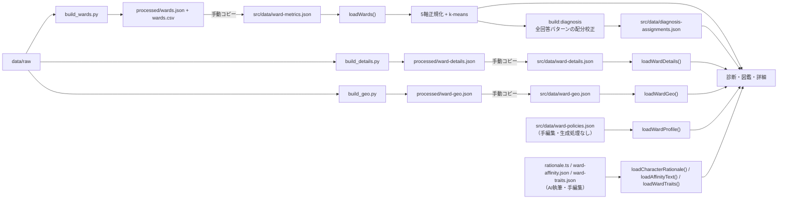

# データ設計

## 1. 方針

公式オープンデータは実行時に取得せず、取得時点のファイルをリポジトリへ保存し、ビルド前に23区単位のJSONへ集計する。アプリが直接読むのは `src/data/` のJSONであり、ブラウザからデータ提供元への通信は発生しない。

## 2. データセット

### 基本5軸

| JSONキー | 指標 | スナップショットの出典 |
|---|---|---|
| `daytime_population_ratio` | 昼夜間人口比率 | 令和2年国勢調査 従業地・通学地による人口・就業状態等集計 |
| `aging_rate` / `youth_rate` | 高齢化率 / 年少人口率 | 住民基本台帳による東京都の世帯と人口 年齢別人口（令和8年1月） |
| `park_area_per_capita` | 一人当たり公立公園面積 | 東京都建設局 都市公園等区市町村別面積・人口割合表（令和7年4月1日） |
| `single_household_rate` / `family_household_rate` | 単身世帯率 / 子育て世帯率 | 令和2年国勢調査 人口等基本集計 第10表 |
| `fiscal_strength_index` | 財政力指数 | 総務省 全市町村の主要財政指標（令和5年度） |

公園面積は公立公園合計の一人当たり面積を使い、国民公園と公団を含めない。世帯の子育て世帯数は、国勢調査の総数行にある子どもを含む対象3列の合計から算出する。

### 区詳細

| JSONキー | 指標 | スナップショットの出典 |
|---|---|---|
| `land_price_avg` | 住宅地の地価公示平均 | 国土交通省 令和7年地価公示 |
| `land_price_points` | 平均に使った標準地点数 | 同上 |
| `population` | 総人口（年少+生産年齢+老年） | 住民基本台帳による世帯と人口（令和8年1月1日現在） |
| `income_per_taxpayer` | 納税義務者1人当たり課税対象所得（千円） | 総務省「市町村税課税状況等の調」（令和6年度）〔市町村別内訳〕第11表（`soumu_J51-24-b.xlsx`）。課税対象所得 ÷ 所得割の納税義務者数で算出する |
| `foreign_rate` | 外国人人口 ÷ 住民基本台帳総人口 | 東京都の統計「国籍・地域別 外国人人口」および住民基本台帳（令和8年1月1日） |
| `crime_per_1000` | 人口千人当たり刑法犯認知件数 | 警視庁「区市町村の町丁別、罪種別及び手口別認知件数」令和6年分（`keishicho_R6_ninchikensu.csv`）。「市区町丁」列が区名と完全一致する公式合計行の「総合計」を採用し、町丁明細行の合算はしない（区名のみの合計行を町丁行と二重集計しないため） |
| `waiting_children` | 待機児童数（人） | 東京都福祉局「保育サービスの状況」令和7年4月1日現在（`tocho_hoiku_r7_hyou4.xlsx` 表4） |

駅乗降人員用の `top_stations` は型とUIの受け口だけがある。生成処理は23区を一貫して対応づけられる入力を持たないため、全区分を不採用にしてJSONへ出力しない。

現在の `ward-details.json` は、地価、人口、平均所得、外国人人口比率、人口千人当たり刑法犯認知件数、待機児童数を23区すべてに持つ。`income_per_taxpayer` と `foreign_rate` はジェネレーター上では全区分がそろわない場合に指標全体を落とす任意項目であり、`top_stations` は全区分で欠落している。犯罪統計と待機児童数はTypeScriptの型上は任意だが、現行ジェネレーターは23区完備を必須として停止する。

### ジオデータ

| JSONキー | 内容 | スナップショットの出典 |
|---|---|---|
| `wards[].rings` | 区境界の外周リングのみ（面積降順、内穴は保持しない）、局所平面km座標 | 「国土数値情報（行政区域データ）」（国土交通省）を [smartnews-smri/japan-topography](https://github.com/smartnews-smri/japan-topography) が簡略化したTopoJSON（`data/raw/N03-21_13_city.topojson`、実DL元ファイル名 `N03-21_13_210101.json`、s0010簡略度） |
| `wards[].center` | 最大リングの符号付き面積（shoelace公式）から算出した重心 | 同上 |
| `wards[].area_km2` | 全リングの面積絶対値の合計 | 同上 |

投影は東京中心（lon139.75 / lat35.69）の等距円筒近似で、経度1度=111.320×cos(lat0) km、緯度1度=110.574 kmの固定係数を使う装飾地図用途の近似であり、測地系変換や正確な行政界描画には使わない。0.02km²未満の微小リング（岩礁等）は捨てる。

地図表示は3D（`WardMap3D`）・2D（`WardMap2D`）とも `src/data/geo.ts` の `loadWardGeo()` を使う。`src/lib/geo.ts` の純関数（`geoBounds` / `toView` / `ringToPath` / `nearestWards`）は2D SVGの座標変換、パス生成、近隣ラベル選択を担当する。3D側は同じリング列からThree.jsの `Shape` を直接生成する。

### キャラクター設定理由（AI執筆・コード同梱）

`src/data/rationale.ts` は23区分の「キャラクター設定理由」テキストを区コードキーの定数として同梱する。`docs/strategy/ward-character-profiles.md` のデータ→ビジュアル変換ルールと各区の根拠数値に基づきAIが執筆した3〜4文で、実データ指標からデザイン判断への流れを説明する。ローダー `loadCharacterRationale()` は未知コードに `null` を返す。文中の数値は取得時点のスナップショットであり、データ更新時は本文との整合を確認する。

### 相性文（AI執筆・コード同梱）

`src/data/ward-affinity.json` は5軸×23区=115本の相性文をアプリへ同梱する。キー構造は `{ 区コード: { 軸キー: 文 } }` で、全23区×5軸を必須とする。各文は2〜3文で、その軸で診断者と区が近い前提で書き、方向は区側の軸値の符号に合わせる（例: 新宿の世帯軸は低いため、おひとりさま向けの文になる）。区の実データの数値と23区順位を盛り込み、トーンは中立・前向きとする。ローダー `src/data/affinity.ts` の `loadAffinityText(code, axis)` は未知の組に `null` を返す。数値は執筆時点の `src/data/ward-metrics.json` のスナップショットであり、データ更新時は本文との整合を確認する。

### 区タイプ特徴（AI執筆・コード同梱）

`src/data/ward-traits.json` は、結果ページの「{区名}ちゃんタイプの特徴」に使う短文を区コードごとに3行ずつ同梱する。内容は `src/hero/wards.ts` のキャッチコピーと5軸の傾きに合わせ、中立・前向きな表現にする。各行はカード内に収めるため30字以内とし、ローダー `src/data/traits.ts` の `loadWardTraits(code)` は未知コードに空配列を返す。キャッチコピーまたは区ベクトルを変更した場合は本文との整合を確認する。

### 区プロフィール（手動キュレーション）

`src/data/ward-policies.json` は集計パイプラインを経ない手編集データで、区コードをキーに次を持つ。

| フィールド | 内容 | 制約 |
|---|---|---|
| `flowers[]` / `trees[]` / `birds[]` | 区の花・木・鳥（各項目は任意） | 空文字・重複のない文字列配列 |
| `policies[]` | 基本構想・総合計画等からの政策キュレーション（任意） | 最大5件、`title`は30字以内、`summary`は120字以内、`url`は`https://`で始まる |
| `policies[].axes[]` | 政策に関連する診断軸のタグ（任意・手動キュレーション） | `AXIS_KEYS` の値のみ・重複なし。全区に1件以上のタグ付き政策を置く |

診断結果ページは `pickPolicyForAxes()` で一致軸とタグが交差する最初の政策を選び、交差がなければ先頭の政策を表示する。

現在のJSONは23区分を収録しているが、未収録区・未収録フィールドを許容するローダー設計であり、`src/data/policies.ts` の `loadWardProfile()` は未知または未収録の区に `null` を返す。区章画像 `public/emblems/{slug}.svg` は手動配置された生成パイプライン対象外のアセットである。区詳細ページは画像読み込み失敗時に `onError` で非表示にする。SVGごとの取得URL・取得日・作者・ライセンス根拠はリポジトリ内に保持しておらず、ファイルだけから取得元を判定できないため、権利情報の再検証性は [07-risks-and-concerns.md](07-risks-and-concerns.md) の懸念事項とする。

## 3. ファイルと所有権

| パス | 種別 | 更新方法 |
|---|---|---|
| `data/raw/*` | 公式データ原本 | 提供元から取得して置換 |
| `data/build_wards.py` | 基本指標ジェネレーター | 手編集するソース |
| `data/build_details.py` | 詳細指標ジェネレーター | 手編集するソース |
| `data/processed/wards.json` | 基本指標の生成物 | `build_wards.py` で再生成 |
| `data/processed/wards.csv` | 基本指標の確認用生成物 | `build_wards.py` で再生成 |
| `data/processed/ward-details.json` | 詳細指標の生成物 | `build_details.py` で再生成 |
| `data/build_geo.py` | ジオデータジェネレーター | 手編集するソース |
| `data/processed/ward-geo.json` | ジオデータの生成物 | `build_geo.py` で再生成 |
| `src/data/ward-metrics.json` | アプリ同梱スナップショット | processedから手動コピー |
| `src/data/ward-details.json` | アプリ同梱スナップショット | processedから手動コピー |
| `src/data/ward-geo.json` | アプリ同梱スナップショット | processedから手動コピー |
| `src/data/diagnosis-assignments.json` | アプリ同梱の診断割り当て | `npm run build:diagnosis` で再生成 |
| `src/data/ward-policies.json` | アプリ同梱データ | `data/processed` に対応物はなく直接手編集する |
| `src/data/rationale.ts` | アプリ同梱データ（AI執筆テキスト） | `docs/strategy/ward-character-profiles.md` を根拠に手編集する |
| `src/data/ward-affinity.json` | アプリ同梱データ（AI執筆相性文） | 基本指標・順位・5軸方向との整合を確認して手編集する |
| `src/data/ward-traits.json` | アプリ同梱データ（AI執筆タイプ特徴） | キャッチコピー・5軸方向との整合を確認して手編集する |
| `public/emblems/*.svg` | アプリ同梱データ | 手動取得・配置（生成処理とファイル別の来歴台帳なし） |

`data/processed` と `src/data` の同期は現在自動化されていない。アプリ動作の正は `src/data`、集計結果の正は `data/processed` であるため、データ更新時は必ず同一内容にそろえる。

## 4. 生成フロー



### エンコーディング

- UTF-8 BOM付きCSV: `utf-8-sig`
- 公園調書、地価公示CSV: `cp932`
- 国勢調査の世帯類型: XLSXを `openpyxl` でread-only読込

## 5. データ更新手順

```bash
/usr/bin/python3 data/build_wards.py
/usr/bin/python3 data/build_details.py
/usr/bin/python3 data/build_geo.py

cp data/processed/wards.json src/data/ward-metrics.json
cp data/processed/ward-details.json src/data/ward-details.json
cp data/processed/ward-geo.json src/data/ward-geo.json

npm run build:diagnosis
npm test
npm run build
```

`build_geo.py` は `data/raw/N03-21_13_city.topojson` の更新が前提であり、基本5軸・区詳細のraw更新とは独立して再実行できる。`build:diagnosis` は質問、基本5軸、区順序のいずれかを変更した場合に必ず実行する。`src/data/ward-policies.json`、`rationale.ts`、`ward-affinity.json`、`ward-traits.json`、`public/emblems/*.svg` は生成コマンドを持たないため、この手順では再生成されない。変更条件と手動更新方法は本ページ末尾を参照する。

更新後は次も確認する。

```bash
cmp data/processed/wards.json src/data/ward-metrics.json
cmp data/processed/ward-details.json src/data/ward-details.json
cmp data/processed/ward-geo.json src/data/ward-geo.json
git diff -- data/processed src/data
```

## 6. 検証ルール

ジェネレーターは次のゲートを持つ。

- 基本5軸の全入力が23区分そろわなければassertで停止する。
- 地価公示・総人口（住民基本台帳）・犯罪統計・待機児童数が23区分そろわなければassertで停止する。
- 外国人人口比率・平均所得（課税対象所得）・駅情報に欠損区があれば、その指標全体を出力対象から落とす（`inc_missing` / `fr_missing` / `ts_missing` を出力してdrop）。
- 区コードは `13101` から `13123`、並び順はJIS区コード順とする。
- `build_geo.py` はWARD_IDS 23区分の欠損があればassertで停止し、生成物サイズが120KBを超えてもassertで停止する（簡略化率を上げて再生成する）。

Vitestは、基本データと詳細データの23区件数、基本指標の存在、正規化範囲、代表値、slugの双方向対応、ジオデータ23区分の座標・面積の妥当性、診断割り当ての再生成一致・全区1〜10%・距離順位5位以内を検証する。`ward-policies.json` については、存在するキーが正しい区コードであること、政策の文字数上限・出典URL形式、軸タグが `AXIS_KEYS` の値のみで全区に1件以上あること、花・木・鳥の配列が空文字と重複を含まないことを検証するが、23区完備はテスト条件にしていない。AI執筆データは、`rationale.ts` の23区完備・最低文字数・代表的な根拠語、`ward-affinity.json` の23区×5軸完備・最低文字数、`ward-traits.json` の23区×3行完備・空文字なし・各30字以内を検証する。

## 7. 手動キュレーション・AI執筆データの更新運用

`src/data/ward-policies.json`（区の花・木・鳥、政策）と `public/emblems/*.svg`（区章）は集計パイプラインを持たない手編集データである。`src/data/rationale.ts`、`ward-affinity.json`、`ward-traits.json` も生成コマンドを持たないAI執筆済みの同梱データであり、次を目安に見直す。

- 政策・区章の更新頻度: 区の基本構想・総合計画の改定は数年単位のため、年1回程度を目安に棚卸しする。
- AI執筆文: 基本指標・23区順位・5軸・キャッチコピーを変更した場合は、該当区の設定理由、5軸別相性文、タイプ特徴を同じ変更で見直す。数値や方向が旧スナップショットのまま残らないことを確認する。
- 出典: `policies[].source` / `url` は必ず一次情報（区公式サイト等）を指し、`https://` のURLを持つ。花・木・鳥も区公式サイトで照合し、調査記録を `docs/research/` に残す。
- 中立性: `title` ≤30字・`summary` ≤120字の制約は、キュレーション文を簡潔かつ主観の混入しにくい長さに収めるためのガード。区の表現は中立・前向きにする全体方針（AGENTS.md）に従う。
- 区章: 採用時に配布元ページと自治体章の扱いを確認する。取得URL、取得日、作者、ライセンス根拠を別途記録し、根拠が不明な画像は使わない。画像取得に失敗しても区詳細ページの他の内容に影響しないよう、`` で非表示にする実装（`src/ui/pages/WardPage.tsx`）を維持する。
- 現在は23区分を収録済みだが、ローダー上の必須条件ではない。`loadWardProfile()` は未収録区に `null` を返し、対応するUIセクション（区のこころざし・区の花木鳥）はその区だけ非表示になる。

## 8. 表示用マスター

区名、slug、キャッチコピー、テーマカラー、地理相対座標は `src/hero/wards.ts` に固定テーブルとして置く。これは統計JSONとは別の表示用マスターであり、画像パス、静的ルート、テーマ、ヒーロー配置に共有される。
