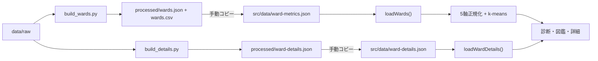

# データ設計

## 1. 方針

公式オープンデータは実行時に取得せず、取得時点のファイルをリポジトリへ保存し、ビルド前に23区単位のJSONへ集計する。アプリが直接読むのは `src/data/` のJSONであり、ブラウザからデータ提供元への通信は発生しない。

## 2. データセット

### 基本5軸

| JSONキー | 指標 | スナップショットの出典 |
|---|---|---|
| `daytime_population_ratio` | 昼夜間人口比率 | 令和2年国勢調査 従業地・通学地による人口・就業状態等集計 |
| `aging_rate` / `youth_rate` | 高齢化率 / 年少人口率 | 住民基本台帳による東京都の世帯と人口 年齢別人口（令和8年1月） |
| `park_area_per_capita` | 一人当たり公立公園面積 | 東京都建設局 都市公園等区市町村別面積・人口割合表（令和7年4月1日） |
| `single_household_rate` / `family_household_rate` | 単身世帯率 / 子育て世帯率 | 令和2年国勢調査 人口等基本集計 第10表 |
| `fiscal_strength_index` | 財政力指数 | 総務省 全市町村の主要財政指標（令和5年度） |

公園面積は公立公園合計の一人当たり面積を使い、国民公園と公団を含めない。世帯の子育て世帯数は、国勢調査の総数行にある子どもを含む対象3列の合計から算出する。

### 区詳細

| JSONキー | 指標 | スナップショットの出典 |
|---|---|---|
| `land_price_avg` | 住宅地の地価公示平均 | 国土交通省 令和7年地価公示 |
| `land_price_points` | 平均に使った標準地点数 | 同上 |
| `population` | 総人口（年少+生産年齢+老年） | 住民基本台帳による世帯と人口（令和8年1月1日現在） |
| `income_per_taxpayer` | 納税義務者1人当たり課税対象所得（千円） | 総務省「市町村税課税状況等の調」（令和6年度）〔市町村別内訳〕第11表（`soumu_J51-24-b.xlsx`）。課税対象所得 ÷ 所得割の納税義務者数で算出する |
| `foreign_rate` | 外国人人口 ÷ 住民基本台帳総人口 | 東京都の統計「国籍・地域別 外国人人口」および住民基本台帳（令和8年1月1日） |

駅乗降人員用の `top_stations` は型とUIの受け口だけがある。現在の生成処理は23区を一貫して対応づけられる入力を持たないため、全区分を不採用にしてJSONへ出力しない。

## 3. ファイルと所有権

| パス | 種別 | 更新方法 |
|---|---|---|
| `data/raw/*` | 公式データ原本 | 提供元から取得して置換 |
| `data/build_wards.py` | 基本指標ジェネレーター | 手編集するソース |
| `data/build_details.py` | 詳細指標ジェネレーター | 手編集するソース |
| `data/processed/wards.json` | 基本指標の生成物 | `build_wards.py` で再生成 |
| `data/processed/wards.csv` | 基本指標の確認用生成物 | `build_wards.py` で再生成 |
| `data/processed/ward-details.json` | 詳細指標の生成物 | `build_details.py` で再生成 |
| `src/data/ward-metrics.json` | アプリ同梱スナップショット | processedから手動コピー |
| `src/data/ward-details.json` | アプリ同梱スナップショット | processedから手動コピー |

`data/processed` と `src/data` の同期は現在自動化されていない。アプリ動作の正は `src/data`、集計結果の正は `data/processed` であるため、データ更新時は必ず同一内容にそろえる。

## 4. 生成フロー



### エンコーディング

- UTF-8 BOM付きCSV: `utf-8-sig`
- 公園調書、地価公示CSV: `cp932`
- 国勢調査の世帯類型: XLSXを `openpyxl` でread-only読込

## 5. データ更新手順

```bash
/usr/bin/python3 data/build_wards.py
/usr/bin/python3 data/build_details.py

cp data/processed/wards.json src/data/ward-metrics.json
cp data/processed/ward-details.json src/data/ward-details.json

npm test
npm run build
```

更新後は次も確認する。

```bash
cmp data/processed/wards.json src/data/ward-metrics.json
cmp data/processed/ward-details.json src/data/ward-details.json
git diff -- data/processed src/data
```

## 6. 検証ルール

ジェネレーターは次のゲートを持つ。

- 基本5軸の全入力が23区分そろわなければassertで停止する。
- 地価公示が23区分そろわなければassertで停止する。
- 外国人人口比率または駅情報に欠損区があれば、その指標全体を出力対象から落とす。
- 区コードは `13101` から `13123`、並び順はJIS区コード順とする。

Vitestは、23区件数、基本指標の存在、正規化範囲、代表値、詳細データ件数、slugの双方向対応を検証する。

## 7. 表示用マスター

区名、slug、キャッチコピー、テーマカラー、地理相対座標は `src/hero/wards.ts` に固定テーブルとして置く。これは統計JSONとは別の表示用マスターであり、画像パス、静的ルート、テーマ、ヒーロー配置に共有される。
