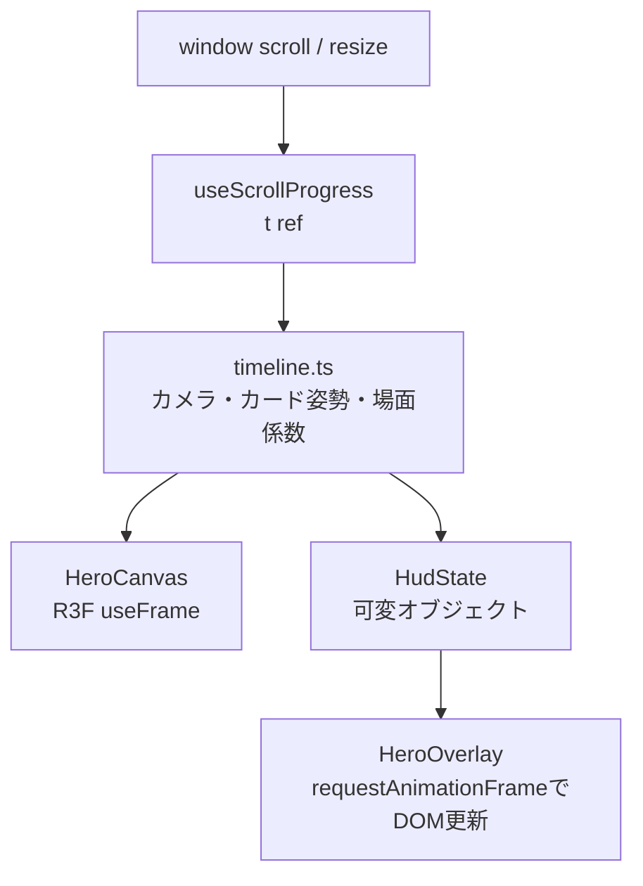

# フロントエンド・描画設計

## 1. 表示方針

通常の文章、見出し、ボタン、区名はDOMで描画し、演出に限定してWebGLを使う。これにより、日本語の可読性、リンク操作、静的HTML、フォールバックを維持しながら3D表現を加える。

全体のブック調UIは `app/globals.css` と `app/zukan.css` が担当する。区ごとのテーマカラーは `src/hero/wards.ts` から `wardTheme()` を介してCSSカスタムプロパティへ渡す。

## 2. ヒーロー

`Hero` は450vhのラッパー内に100vhの表示領域をsticky固定する。ネイティブスクロールから進捗 `t = 0..1` を求め、React stateを毎フレーム更新せず、ref経由でThree.jsオブジェクトとDOM styleへ反映する。

タイムラインはスクロール進捗だけで状態が決まる純関数であり、逆スクロール時も同じ経路を逆再生する。

| 進捗の目安 | 表示 |
|---|---|
| `0.00–0.15` | タイトル・診断CTA・スクロールヒント、2区カードのチラ見せ、霧の開放、金粉・紙片のバースト |
| `0.15–0.80` | 23区カード回廊と6区のクローズアップ |
| `0.80–1.00` | 横長は東京相対配置、縦長は雛壇へ集結し、締めタイトルと図鑑への誘導文を表示（診断CTAはファーストビューと直下の診断セクションが担う） |

カード配置、粒子、浮遊位相はseed付き乱数からモジュール初期化時に一度だけ生成する。再レンダーごとの乱数は使わない。

ファーストビュー（t≈0）は次の要素で構成する。

- タイトル直下の診断CTA（`phases.title` に連動して表示・クリック可否を切り替える）と、ロゴのアルファをマスクに使うシマーアニメーション（`HeroOverlay` 内のCSS。reduced motionで停止）。
- 新宿・渋谷2区のカードチラ見せ。`manifest.ts` の `peek` 設定（rng非消費）と `cardPose` のpeek項で画面端に配置し、スクロール開始とともに回廊の定位置へ戻る。縦長画面では遠く・小さく補正する。
- 開幕の暗さはDOMビネットでなくシーン内フォグ（`HeroCanvas` がscene fogと `CardMaterial` のフォグuniformを連動）を絞って作り、スクロールで霧が開く。
- 無操作が約4秒続くと `useScrollProgress` が `attract.ts` の純関数パルスを進捗に合成し、ページがめくれかけて戻る動きでスクロールを促す。操作で即減衰し、reduced motionと `?herot=` 固定時は無効。

## 3. 診断UIの演出

診断（`Diagnosis` コンポーネント）は `src/lib/diagnosisFlow.ts` の状態機械（`FlowPhase`: `cover → asking → stamping → turning → finale → done`）に従い、1問ごとに `asking → stamping → turning` を繰り返す純粋なreducer `reduceFlow` でフェーズを進める。UI側は `FLOW_TIMINGS` の定数だけを頼りに `setTimeout` でイベントを発火し、DOM/タイマーに依存する処理をreducerから分離している。

- `cover`: 表紙が開く演出（`FLOW_TIMINGS.coverMs = 700ms`）。
- `asking`: 選択肢クリックで `PICK` イベントを発行し回答を確定、`stamping` へ遷移する。
- `stamping`: 選んだ選択肢に封蝋スタンプ（✓）を表示する固定時間（`FLOW_TIMINGS.stampMs = 380ms`、reduced-motion時は `REDUCED_STAMP_MS = 160ms`）。
- `turning`: ページターン演出（`FLOW_TIMINGS.turnMs = 580ms`。stamp+turnの合計960msを1問あたり約1秒以内に収める）。次の質問ページを下層、現在ページを上層に重ねた2層構造で描画する。
- `finale`（10問目回答後のみ）: パラパラめくりの装飾ページと「あなたに一番似ているのは…」を `FLOW_TIMINGS.finaleMs = 2000ms` 表示する。クリック・Enter・Spaceでいつでもスキップでき（`SKIP` イベント）、即座に `done` へ進む。

`prefers-reduced-motion` 時は `initialFlowState` が初期フェーズを `cover` でなく `asking` にし、`turning` フェーズと `finale` フェーズを経由しない（`stamping` 完了で直接次の `asking` または `done` へ進む）ため、全10問が実質即時に進行する。reduced判定はマウント時に一度だけ固定し、回答途中でフロー分岐が変わらないようにする。

`done` 到達時に `onComplete(vector, answers)` で採点結果を確定し `App` が `/result/{slug}/` へ遷移させる。加えて、最終問（10問目）回答直後の `finale` 突入時に `onAnswersFixed(answers)` が呼ばれ、`App` はこれを使って結果ページを `router.prefetch()` し、結果OGP画像を `new Image().src` でpreloadする。フィナーレ演出の裏で結果ページと画像を先読みすることで、遷移直後のローディング待ちを隠す（`prefers-reduced-motion` 時は前述のとおり `finale` を経由しないため `onAnswersFixed` は呼ばれず、この先読みは行われない）。

## 4. 品質ティアとフォールバック

品質はクライアントの初回マウント後に判定する。

| ティア | 条件 | 主な設定 |
|---|---|---|
| `high` | デスクトップ相当、WebGL利用可 | ヒーローDPR上限2.0（区地図1.5）、896pxテクスチャ、粒子多、マウス傾きあり |
| `low` | 粗いポインタ、幅768px未満、端末メモリ4GB以下 | DPR 1.2、512pxテクスチャ、粒子削減、遠景削減 |
| `fallback` | reduced motion、WebGL不可、Canvas例外 | 2Dカード一覧と診断CTA |

Canvasの初期化後例外はReact Error Boundaryで捕捉し、2D表示へ切り替える。`prefers-reduced-motion` はアニメーションを減らすだけでなく、3Dヒーローを使用しない判断にも使う。

開発・検証用に次のクエリを受け付ける。

- `?view=high|low|2d`: 品質ティアを強制
- `?herot=0..1`: ヒーローのスクロール進捗を固定

## 5. 区詳細ページの地図

区詳細ページの「東京のどこにいる？」セクション（`src/ui/WardMapSection.tsx`）は、ヒーローと同じ `src/hero/quality.ts` の `detectQuality()` で3D/2Dを出し分ける。

| 判定結果 | 表示 |
|---|---|
| `high` / `low` | `WardMap3D`（`dynamic(..., { ssr: false })` で読み込むR3F押し出しマップ。品質ティアに応じてDPRだけ変える） |
| `fallback`（reduced motion / WebGL不可） | `WardMap2D`（SVGの2D羊皮紙地図。対象区と近隣区名をDOM内のSVGで示す） |

`tier` は初回マウント後の `useEffect` で確定するまで `null` であり、`null` の間も2D側にフォールバックする（サーバー描画とのハイドレーション不整合を避けるため）。3D初期化後に例外が起きた場合はコンポーネント内の `MapErrorBoundary`（React Error Boundary）が捕捉し、その区に限り2Dへ切り替える。ヒーローと同じ `?view=2d` クエリで強制的に2D表示へ切り替えられる。

3D/2Dマップは `src/data/geo.ts` の `loadWardGeo()` を共有する。3D側はリングから `THREE.ExtrudeGeometry` / `EdgesGeometry` を区ごとに生成し、対象区だけ高さ、色、発光、ピンで強調する。生成したgeometryはアンマウント時に `dispose()` する。2D側は `src/lib/geo.ts` の純関数でSVGパスと近隣ラベルを生成する。

## 6. 区モーダルとレーダー

区モーダルは、背景クリックまたはEscapeで閉じる。動きが許可されている場合は表紙の開閉アニメーションを行い、`animationend` を受け取れない場合に備えてタイマーでも状態を進める。

レーダーは `Radar`（SVGの2D表示）に統一し、区モーダル、結果ページ、区詳細、シェアカードで共有する。モーダルと結果ページのステータスは `buildRadarStats` が返すレーダー5軸の根拠となる基本7指標に限定し、各行は区詳細ページと同じ `StatBar` で表示する。区詳細ページの `buildWardStats` はこの7指標に地価等の詳細指標を加える。これにより、診断結果から根拠となる基本指標を確認でき、全指標は区詳細ページで確認する表示階層とする。

レーダー値 `[-1, 1]` は描画半径 `[0, 1]` へ変換する。`Radar` はオプションの `overlay` ベクトルを受け取り、主ポリゴンの上に破線ポリゴンを重ねられる。

結果ページのヒーローは診断済みか未診断かで分岐する。診断済みユーザーには幅 `min(820px, 100%)` の「結果カード」（`data-testid="result-card"`）を表示する。区別OGP画像（`public/og/{slug}.jpg`、1200×630）の下端にスクリムを重ね、画像上へ区名（小）と `similarityPercent(ranked[0].distance)` によるにてる度%（大）をオーバーレイする。画像下にキャッチコピーと一致軸2本のハッシュタグ（`matchedAxisTags` がユーザー側の極ラベルを返す）、区色のXシェアボタンと `/ward/{slug}/` への「詳しく見る」導線を置き、ファーストビューで「結果→シェア」が完結する。未診断の閲覧者には従来どおり区別OGP画像と「あなたも診断する」CTAを表示する。

診断経由の結果カードは、表示時にスケールインの入場演出（CSS `resultCardIn`、0.5秒）を行い、にてる度%は0から実値まで `useCountUp`（900msのイージング）でカウントアップし、カード上に金色の紙吹雪（`data-testid="result-confetti"`、20個のパーティクルが一度だけ落下しループしない）を重ねる。これらの演出はいずれも `userVector` が存在する診断経由の初回描画時だけ発生し、共有受け手表示では出さない。`prefers-reduced-motion` 時はカード入場アニメーションと紙吹雪をCSSで無効化し、カウントアップも `useCountUp` 側の分岐で行わず最初から実値の%を表示する。

以降は ②「{区名}ちゃんタイプの特徴」（`src/data/ward-traits.json` のAI執筆3行と `personaType` の総評）、③「なぜ相性がいいの？」（ページ内で唯一のレーダーに利用者ベクトルを `overlay` で重ね、`selectMatchedAxes` の一致軸2本だけの比較バーを表示。軸差0.5以下の軸に「ここが一致！」バッジ、一致軸1位のAI相性文を添える）、④「もっと詳しく」（`
` のアコーディオン3つ: キャラクター設定理由・一致軸のデータカードと政策・`StatBar` によるステータス一覧と区詳細導線。レーダーは置かない）、⑤ 相性ランキング3件（各区のOGP画像。%は `compatibilityPercents` の相対スケーリング値で、結果の%を超えない。640px以下では横スクロール表示）、⑥ 最後のシェアCTA（「この結果、誰かに似ていませんか？」とシェアボタンのみ）の順に表示する。未診断の閲覧者には②③⑤⑥を出さず、④の性格・ステータスのアコーディオンのみ表示する。

X共有は `src/ui/share.ts` の `xShareText` / `xShareUrl` / `xWeightedLength` が担う。診断済みは「診断したら{区名}ちゃんと にてる度{XX}% だった！タイプは「{タイプ名}」らしい」、未診断は従来のキャラクターの一言入り文面で、いずれも末尾に `#うちの区ちゃん`、`#都知事杯オープンデータハッカソン` の2つのハッシュタグを付ける。X（Twitter）の加重文字数（半角1単位・全角や絵文字2単位、URLは常に23単位）で280単位を超えないことをVitestで保証する（全23区×最長タイプ名×にてる度100%の最悪ケースを含む）。共有CTAは結果カード内のボタン・ページ最下部のCTA・画面下部の追従シェアバーの3箇所に置く。追従シェアバーは `@media (max-width: 640px)` のモバイル幅のみ表示し、PCでは出さない。いずれも診断済みのときだけ表示する。

`/result/[slug]/` と `/ward/[slug]/` は、`wardPalette`（`src/lib/wardPalette.ts`）が髪色由来テーマカラーから導出する配色トークンを `paletteVars` でルート要素のCSSカスタムプロパティ（`--w-bg` / `--w-card` / `--w-accent` / `--w-accent-text` / `--w-accent-dark` / `--w-ink`）として注入し、背景・カード・アクセントを区ごとの色合いにする。CSS側のフォールバック値は従来の絵本トーン（革表紙 #17110c / 羊皮紙 #f7ecd4 / 金 #b8923f / 墨 #4a3418）で、変数を注入しないトップ・図鑑は従来配色のまま変わらない。アクセントのコントラスト（カード地3:1以上・ボタン文字4.5:1以上・暗背景4.5:1以上）はVitestで全23区について保証する。

## 7. 画像アセット

| 原本 | 生成物 | 生成処理 |
|---|---|---|
| `assets/characters/ssr/{slug}.png` | `public/characters/ssr/{slug}-w512.webp` | `scripts/build-hero-images.mjs` |
| 同上 | `public/characters/ssr/{slug}-w896.webp` | 同上 |
| `assets/title.png` | `public/title-w720.webp`, `title-w1440.webp` | `scripts/build-title.mjs` |
| `assets/book-cover.png` | `public/book-cover.webp` | `scripts/build-modal-images.mjs` |
| `assets/magic-circle.png` | `public/magic-circle.png` | `scripts/build-modal-images.mjs` |
| `assets/og/{slug}.png`（AI作成OGP原本、トップ用は `home.png`） | `public/og/{slug}.jpg` | `scripts/build-og-images.mjs` で1200×630のJPEG品質85へ加工（原本のスクリプト合成はしない） |

キャラクターは2:3のカードとして扱う。512px版は一覧・低品質3D、896px版は詳細・高品質3Dで使う。Next.jsの画像最適化は静的エクスポートとの整合のため無効で、UIは生成済み画像を直接参照する。

`book-cover.webp` はモーダル表紙のCSS背景として使う。`magic-circle.png` は生成されるが現行UIからは参照されない。

OGPは1200×630pxのJPEG（品質85）を23区分＋トップ用 `home.jpg` の24枚そろえる。SNSクローラーの取得失敗を避けるため1枚300KB以下を目安とし、PNGではなくJPEGで配信する。原本は生成AIに依頼して作成し、`assets/og/{slug}.png` に置いてから `npm run build:og` で `public/og/{slug}.jpg` へ加工する。区ごとの生成プロンプトは [docs/strategy/og-image-prompts.md](../strategy/og-image-prompts.md) にまとめている。OGP原本をコードで合成生成する仕組みは持たない。

OGPメタデータは `app/layout.tsx` が `NEXT_PUBLIC_SITE_URL` 設定時だけサイト共通の `metadataBase` を追加し、`og:site_name`、トップ用 `/og/home.jpg`、`twitter:card` を持つ。`/result/[slug]/` と `/ward/[slug]/` の `generateMetadata` は区別の `/og/{slug}.jpg` とタイトル・説明で上書きする。

## 8. 初回ロード演出と画像ポップイン対策

初回アクセス時に画像ダウンロード中の未完成な画面が見えないよう、全ページ共通の初回ロード演出を持つ。

- マークアップ `#first-load`（絵本が開くCSSアニメーションと「うちの区ちゃん図鑑をひらいています…」の文言）は `app/layout.tsx` に静的に置き、プリレンダーHTMLに含める。外部画像は参照せず、JSロード前から即描画される。
- `<head>` のインラインスクリプトが描画前に実行され、(1) `<html>` へ `uk-js` クラスを付与（JS前提のCSS演出のゲート）、(2) `sessionStorage` の `uk-visited` があれば `uk-revisit` クラスを付与し、CSSでロード画面を即非表示、(3) ハイドレーション失敗に備え4秒で強制フェードするフォールバックタイマーを仕掛ける。
- `src/ui/FirstLoad.tsx`（layoutに配置）がハイドレーション後に主要画像（タイトルロゴと、6区あるクローズアップ対象のうち序盤3区。品質ティアに応じて512/896px）をプリロードし、「全完了 or 2秒」の早い方で `uk-visited` を保存してフェードアウトする。純ロジックは `src/lib/firstLoad.ts` にあり、`sessionStorage` 不可の環境では毎回初回扱いで表示して閉じるだけで実害はない。
- `prefers-reduced-motion` ではロード画面のアニメーションを止めて静止表示する。
- 図鑑カード画像はロード完了時（`onload`）に `is-loaded` クラスを付与し、0.3秒のフェードインでポップインを防ぐ。未ロード状態を `opacity: 0` で隠す方式はChromiumが `loading="lazy"` 画像を「不可視」とみなし取得をスキップするため使わない。JS無効時（`uk-js` なし）はフェードを適用しない。
- カード画像は `height` 属性のpresentational hintが `aspect-ratio: 2 / 3` に勝たないよう、CSSで `height: auto` を明示してレイアウトを予約する。
- 図鑑カードは系統ラベルを廃止し、フルブリード立ち絵に区テーマカラーの縁取りを重ね、下部グラデーション上に金文字の区名プレートとメダリオンNo.を配置する構成にしている。グリッドは `minmax(160px, 1fr)` で流し込み、幅480px以下は `repeat(2, 1fr)`・gap 12pxの2カラム固定にする。
- ホバー演出（浮き上がり、区テーマカラーのグロー、シャイン、キャッチコピーのスライドイン）は `@media (hover: hover)` の内側だけに定義し、タッチ端末でのsticky hover残留を避ける。タッチ端末（hover不可）では、`prefers-reduced-motion` でない場合に限りIntersectionObserverでカードが画面に入った時点で `is-shine` を1回付与しシャインを再生する。IntersectionObserver/matchMedia非対応環境では何もしない（静的表示のまま）。
- `prefers-reduced-motion: reduce` では浮き上がり・シャイン・キャッチコピーのスライドインをすべて無効化し、シャイン要素は `display: none` にする。

## 9. アクセシビリティ上の実装

- HTMLの言語は `ja`、viewportを端末幅に設定する。
- 診断進捗は `aria-live="polite"` の領域で更新する。
- 2Dレーダーは `role="img"` と数値を含む代替ラベルを持つ。
- `WardMap2D` は `role="img"` と `「東京23区の中の◯◯区の位置」` の代替ラベルを持つ。3D版のCanvas自体には同等の代替テキストがない。
- モーダルは `role="dialog"`、`aria-modal="true"`、名称、Escape操作、初期フォーカスを持つ。
- 装飾粒子、表紙、不要な画像は支援技術から隠す。
- 3Dが使えない場合も、区選択と診断開始をDOMボタンで提供する。

現行の不足事項は [07-risks-and-concerns.md](07-risks-and-concerns.md) に分離して記載する。
