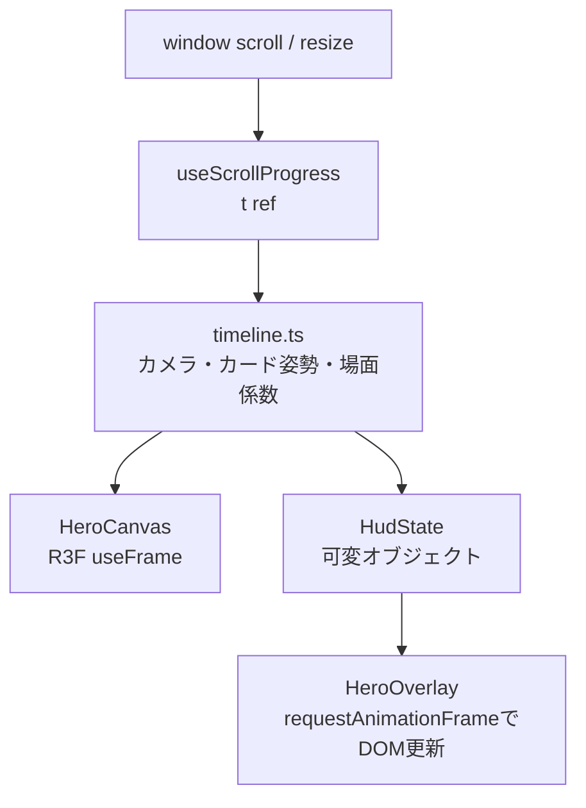

# フロントエンド・描画設計

## 1. 表示方針

通常の文章、見出し、ボタン、区名はDOMで描画し、演出に限定してWebGLを使う。これにより、日本語の可読性、リンク操作、静的HTML、フォールバックを維持しながら3D表現を加える。

全体のブック調UIは `app/globals.css` と `app/zukan.css` が担当する。区ごとのテーマカラーは `src/hero/wards.ts` から `wardTheme()` を介してCSSカスタムプロパティへ渡す。

## 2. ヒーロー

`Hero` は450vhのラッパー内に100vhの表示領域をsticky固定する。ネイティブスクロールから進捗 `t = 0..1` を求め、React stateを毎フレーム更新せず、ref経由でThree.jsオブジェクトとDOM styleへ反映する。

タイムラインはスクロール進捗だけで状態が決まる純関数であり、逆スクロール時も同じ経路を逆再生する。

| 進捗の目安 | 表示 |
|---|---|
| `0.00–0.15` | タイトル、暗転解除、金粉・紙片のバースト |
| `0.15–0.80` | 23区カード回廊と6区のクローズアップ |
| `0.80–1.00` | 横長は東京相対配置、縦長は雛壇へ集結しCTA表示 |

カード配置、粒子、浮遊位相はseed付き乱数からモジュール初期化時に一度だけ生成する。再レンダーごとの乱数は使わない。

## 3. 品質ティアとフォールバック

品質はクライアントの初回マウント後に判定する。

| ティア | 条件 | 主な設定 |
|---|---|---|
| `high` | デスクトップ相当、WebGL利用可 | DPR 1.5、896pxテクスチャ、粒子多、マウス傾きあり |
| `low` | 粗いポインタ、幅768px未満、端末メモリ4GB以下 | DPR 1.2、512pxテクスチャ、粒子削減、遠景削減 |
| `fallback` | reduced motion、WebGL不可、Canvas例外 | 2Dカード一覧と診断CTA |

Canvasの初期化後例外はReact Error Boundaryで捕捉し、2D表示へ切り替える。`prefers-reduced-motion` はアニメーションを減らすだけでなく、3Dヒーローを使用しない判断にも使う。

開発・検証用に次のクエリを受け付ける。

- `?view=high|low|2d`: 品質ティアを強制
- `?herot=0..1`: ヒーローのスクロール進捗を固定

## 4. 区詳細ページの地図

区詳細ページの「東京のどこにいる？」セクション（`src/ui/WardMapSection.tsx`）は、ヒーローと同じ `src/hero/quality.ts` の `detectQuality()` で3D/2Dを出し分ける。

| 判定結果 | 表示 |
|---|---|
| `high` / `low` | `WardMap3D`（`dynamic(..., { ssr: false })` で読み込むR3F押し出しマップ。品質ティアに応じてDPRだけ変える） |
| `fallback`（reduced motion / WebGL不可） | `WardMap2D`（SVGの2D羊皮紙地図。対象区と近隣区名をDOM内のSVGで示す） |

`tier` は初回マウント後の `useEffect` で確定するまで `null` であり、`null` の間も2D側にフォールバックする（サーバー描画とのハイドレーション不整合を避けるため）。3D初期化後に例外が起きた場合はコンポーネント内の `MapErrorBoundary`（React Error Boundary）が捕捉し、その区に限り2Dへ切り替える。ヒーローと同じ `?view=2d` クエリで強制的に2D表示へ切り替えられる。

3D/2Dマップは `src/data/geo.ts` の `loadWardGeo()` を共有する。3D側はリングから `THREE.ExtrudeGeometry` / `EdgesGeometry` を区ごとに生成し、対象区だけ高さ、色、発光、ピンで強調する。生成したgeometryはアンマウント時に `dispose()` する。2D側は `src/lib/geo.ts` の純関数でSVGパスと近隣ラベルを生成する。

## 5. 区モーダルとレーダー

区モーダルは、背景クリックまたはEscapeで閉じる。動きが許可されている場合は表紙の開閉アニメーションを行い、`animationend` を受け取れない場合に備えてタイマーでも状態を進める。

レーダーは `Radar`（SVGの2D表示）に統一し、区モーダル、結果ページ、区詳細、シェアカードで共有する。モーダルのステータスは `buildRadarStats` が返すレーダー5軸の根拠となる基本7指標に限定し、各行は区詳細ページと同じ `StatBar` で表示する。区詳細ページの `buildWardStats` はこの7指標に地価等の詳細指標を加える。これにより、モーダルを概要にとどめ、全指標は区詳細ページで確認する表示階層とする。

レーダー値 `[-1, 1]` は描画半径 `[0, 1]` へ変換する。結果ページでは利用者ベクトルを破線で重ねる。

## 6. 画像アセット

| 原本 | 生成物 | 生成処理 |
|---|---|---|
| `assets/characters/ssr/{slug}.png` | `public/characters/ssr/{slug}-w512.webp` | `scripts/build-hero-images.mjs` |
| 同上 | `public/characters/ssr/{slug}-w896.webp` | 同上 |
| `assets/title.png` | `public/title-w720.webp`, `title-w1440.webp` | `scripts/build-title.mjs` |
| `assets/book-cover.png` | `public/book-cover.webp` | `scripts/build-modal-images.mjs` |
| `assets/magic-circle.png` | `public/magic-circle.png` | `scripts/build-modal-images.mjs` |
| `assets/og/{slug}.png`（AI作成OGP原本、トップ用は `home.png`） | `public/og/{slug}.jpg` | `scripts/build-og-images.mjs` で1200×630のJPEG品質85へ加工（原本のスクリプト合成はしない） |

キャラクターは2:3のカードとして扱う。512px版は一覧・低品質3D、896px版は詳細・高品質3Dで使う。Next.jsの画像最適化は静的エクスポートとの整合のため無効で、UIは生成済み画像を直接参照する。

`book-cover.webp` はモーダル表紙のCSS背景として使う。`magic-circle.png` は生成されるが現行UIからは参照されない。

OGPは1200×630pxのJPEG（品質85）を23区分＋トップ用 `home.jpg` の24枚そろえる。SNSクローラーの取得失敗を避けるため1枚300KB以下を目安とし、PNGではなくJPEGで配信する。原本は生成AIに依頼して作成し、`assets/og/{slug}.png` に置いてから `npm run build:og` で `public/og/{slug}.jpg` へ加工する。区ごとの生成プロンプトは [docs/strategy/og-image-prompts.md](../strategy/og-image-prompts.md) にまとめている。OGP原本をコードで合成生成する仕組みは持たない。

OGPメタデータは `app/layout.tsx` がサイト共通の `metadataBase`（`NEXT_PUBLIC_SITE_URL`）、`og:site_name`、トップ用 `/og/home.jpg`、`twitter:card` を持ち、`/result/[slug]/` と `/ward/[slug]/` の `generateMetadata` が区別の `/og/{slug}.jpg` とタイトル・説明で上書きする。

## 7. 初回ロード演出と画像ポップイン対策

初回アクセス時に画像ダウンロード中の未完成な画面が見えないよう、全ページ共通の初回ロード演出を持つ。

- マークアップ `#first-load`（絵本が開くCSSアニメーションと「うちの区ちゃん図鑑をひらいています…」の文言）は `app/layout.tsx` に静的に置き、プリレンダーHTMLに含める。外部画像は参照せず、JSロード前から即描画される。
- `<head>` のインラインスクリプトが描画前に実行され、(1) `<html>` へ `uk-js` クラスを付与（JS前提のCSS演出のゲート）、(2) `sessionStorage` の `uk-visited` があれば `uk-revisit` クラスを付与し、CSSでロード画面を即非表示、(3) ハイドレーション失敗に備え4秒で強制フェードするフォールバックタイマーを仕掛ける。
- `src/ui/FirstLoad.tsx`（layoutに配置）がハイドレーション後に主要画像（タイトルロゴとクローズアップ3区。品質ティアに応じて512/896px）をプリロードし、「全完了 or 2秒」の早い方で `uk-visited` を保存してフェードアウトする。純ロジックは `src/lib/firstLoad.ts` にあり、`sessionStorage` 不可の環境では毎回初回扱いで表示して閉じるだけで実害はない。
- `prefers-reduced-motion` ではロード画面のアニメーションを止めて静止表示する。
- 図鑑カード画像はロード完了時（`onload`）に `is-loaded` クラスを付与し、0.3秒のフェードインでポップインを防ぐ。未ロード状態を `opacity: 0` で隠す方式はChromiumが `loading="lazy"` 画像を「不可視」とみなし取得をスキップするため使わない。JS無効時（`uk-js` なし）はフェードを適用しない。
- カード画像は `height` 属性のpresentational hintが `aspect-ratio: 2 / 3` に勝たないよう、CSSで `height: auto` を明示してレイアウトを予約する。

## 8. アクセシビリティ上の実装

- HTMLの言語は `ja`、viewportを端末幅に設定する。
- 診断進捗は `aria-live="polite"` の領域で更新する。
- 2Dレーダーは `role="img"` と数値を含む代替ラベルを持つ。
- `WardMap2D` は `role="img"` と `「東京23区の中の◯◯区の位置」` の代替ラベルを持つ。3D版のCanvas自体には同等の代替テキストがない。
- モーダルは `role="dialog"`、`aria-modal="true"`、名称、Escape操作、初期フォーカスを持つ。
- 装飾粒子、表紙、不要な画像は支援技術から隠す。
- 3Dが使えない場合も、区選択と診断開始をDOMボタンで提供する。

現行の不足事項は [07-risks-and-concerns.md](07-risks-and-concerns.md) に分離して記載する。
