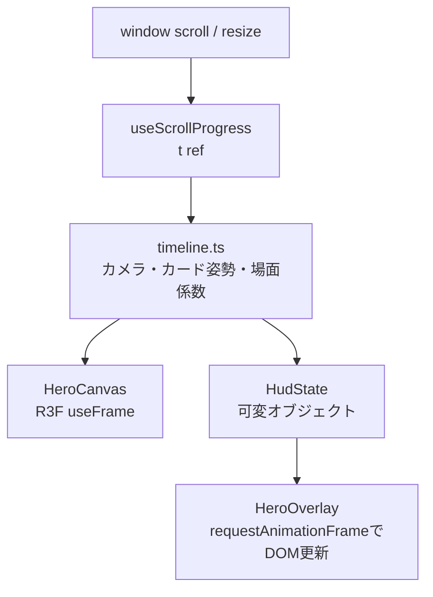

# フロントエンド・描画設計

## 1. 表示方針

通常の文章、見出し、ボタン、区名はDOMで描画し、演出に限定してWebGLを使う。これにより、日本語の可読性、リンク操作、静的HTML、フォールバックを維持しながら3D表現を加える。

全体のブック調UIは `app/globals.css` と `app/zukan.css` が担当する。区ごとのテーマカラーは `src/hero/wards.ts` から `wardTheme()` を介してCSSカスタムプロパティへ渡す。

## 2. ヒーロー

`Hero` は450vhのラッパー内に100vhの表示領域をsticky固定する。ネイティブスクロールから進捗 `t = 0..1` を求め、React stateを毎フレーム更新せず、ref経由でThree.jsオブジェクトとDOM styleへ反映する。

タイムラインはスクロール進捗だけで状態が決まる純関数であり、逆スクロール時も同じ経路を逆再生する。

| 進捗の目安 | 表示 |
|---|---|
| `0.00–0.15` | タイトル、暗転解除、金粉・紙片のバースト |
| `0.15–0.80` | 23区カード回廊と6区のクローズアップ |
| `0.80–1.00` | 横長は東京相対配置、縦長は雛壇へ集結しCTA表示 |

カード配置、粒子、浮遊位相はseed付き乱数からモジュール初期化時に一度だけ生成する。再レンダーごとの乱数は使わない。

## 3. 品質ティアとフォールバック

品質はクライアントの初回マウント後に判定する。

| ティア | 条件 | 主な設定 |
|---|---|---|
| `high` | デスクトップ相当、WebGL利用可 | DPR 1.5、896pxテクスチャ、粒子多、マウス傾きあり |
| `low` | 粗いポインタ、幅768px未満、端末メモリ4GB以下 | DPR 1.2、512pxテクスチャ、粒子削減、遠景削減 |
| `fallback` | reduced motion、WebGL不可、Canvas例外 | 2Dカード一覧と診断CTA |

Canvasの初期化後例外はReact Error Boundaryで捕捉し、2D表示へ切り替える。`prefers-reduced-motion` はアニメーションを減らすだけでなく、3Dヒーローと3Dレーダーを使用しない判断にも使う。

開発・検証用に次のクエリを受け付ける。

- `?view=high|low|2d`: 品質ティアを強制
- `?herot=0..1`: ヒーローのスクロール進捗を固定

## 4. 区モーダルとレーダー

区モーダルは、背景クリックまたはEscapeで閉じる。動きが許可されている場合は表紙の開閉アニメーションを行い、`animationend` を受け取れない場合に備えてタイマーでも状態を進める。

レーダーは次の二段構成である。

- `Radar`: SVGによる常時利用可能な2D表示。結果ページ、区詳細、シェアカードでも共有する。
- `Radar3D`: Three.jsを遅延ロードするモーダル専用表示。ロード完了までは2Dレーダーを表示し、利用不可ならそのまま2Dを使う。

レーダー値 `[-1, 1]` は描画半径 `[0, 1]` へ変換する。結果ページでは利用者ベクトルを破線で重ねる。

## 5. 画像アセット

| 原本 | 生成物 | 生成処理 |
|---|---|---|
| `assets/characters/ssr/{slug}.png` | `public/characters/ssr/{slug}-w512.webp` | `scripts/build-hero-images.mjs` |
| 同上 | `public/characters/ssr/{slug}-w896.webp` | 同上 |
| `assets/title.png` | `public/title-w720.webp`, `title-w1440.webp` | `scripts/build-title.mjs` |
| 配信用キャラ画像 + タイトル | `public/og/{slug}.png` | `scripts/build-og-images.mjs` |

キャラクターは2:3のカードとして扱う。512px版は一覧・低品質3D、896px版は詳細・高品質3Dで使う。Next.jsの画像最適化は静的エクスポートとの整合のため無効で、UIは生成済み画像を直接参照する。

OGPは1200×630pxを23区分生成する。テキスト描画にmacOSのヒラギノ明朝を指定しているため、同一見た目での再生成環境はmacOSを前提とする。

## 6. アクセシビリティ上の実装

- HTMLの言語は `ja`、viewportを端末幅に設定する。
- 診断進捗は `aria-live="polite"` の領域で更新する。
- 2Dレーダーは `role="img"` と数値を含む代替ラベルを持つ。
- モーダルは `role="dialog"`、`aria-modal="true"`、名称、Escape操作、初期フォーカスを持つ。
- 装飾粒子、表紙、不要な画像は支援技術から隠す。
- 3Dが使えない場合も、区選択と診断開始をDOMボタンで提供する。

現行の不足事項は [07-risks-and-concerns.md](07-risks-and-concerns.md) に分離して記載する。
